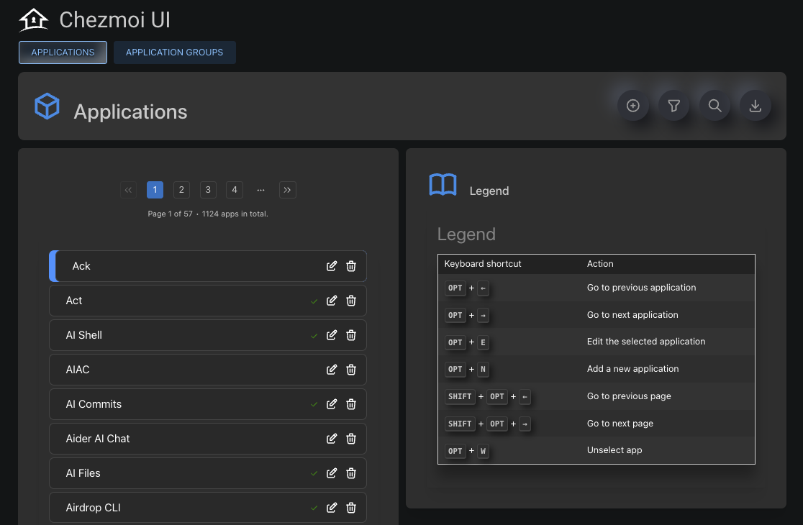

# Chezmoi UI

A web UI for managing a list of apps to seed/feed a [Chezmoi](https://github.com/twpayne/chezmoi) setup.


## Background

Trying out a bunch of dot file management tools it seemed to me most of them are either too sparse, (read: a CLI for creating soft links to a Git repo), or very complex and time-consuming, (read: Install.Doctor). But Chezmoi hits a sweet spot for me. I did like the way [Install.Doctor](https://github.com/megabyte-labs/install.doctor) approached the issue of maintaining a universal list of applications though, offering wide OS support from a unified source. Regardless of what OS I'm faced with, I want to run a script and be able to feel at home. But - crucially - I don't want another full-time job maintaining huge YAML files...


## What it is

So this is a UI for Chezmoi users who like me would like to base a compatible application list on Install.Doctor's impressive curation. But I guess tinkering Install.Doctor users could find it useful too. It's just a simple SPA with a Node backend, and an even simpler SQLite db holding the list data, meant to run locally on your machine. So you need a current Node LTS - (eg. version 20.x and above), or Docker if you don't want to install Node.

Also I've added tags to the mix, as I have some vague plans on using them to control what apps get installed in different environments. If nothing else they can be used for filtering to produce multiple lists for various targets. Feel free to skip them if all you want to do is prune a gigantic list.


## Features

- Web UI for editing a YAML-based list of applications in the Chezmoi/Install.Doctor format
- Run it locally in Node, or in a Docker container
- Edit metadata, remove, add your own apps
- Keyboard shortcuts for a speedy workflow
- Quick search for applications
- Quick link opens application homepage/Github page in new window
- Iconography indicates
  - If URLs to homepage, Github page, documentation page are missing
  - If installation method isn't specified
  - If an application has been edited, (eg. is "dirty" compared to its original state)
  - The tags applied to an application
- Filters showing:
  - Apps without a name
  - Apps without a description
  - Apps without URLs to homepage/Github/docs
  - Apps without installation method
  - Apps not marked completed; (eg. hide completed)
- Tag applications to mark them for specific environments/use cases
- Export edited list back to Chezmoi/Install.Doctor YAML format
  - In its entirety
  - Or filtered on the tags of your choosing
- Export group structure in Install.Doctor format. (Combine with the above to create a complete Install.Doctor "playbook")


## Get started

1. Clone this repo

1. Make sure you have Node 20+ installed. (Unless you prefer to use Docker images)

   (I strongly recommend using `pnpm`instead of `npm` because it's much more robust and performant).

1. Run `setup.sh`. Optionally review and adjust the `.env`files in the `server` and `client` directories respectively

1. Run `pnpm start` from the root directory

Chezmoi UI should now be available at `http://localhost:8000`.

*N.B.* Don't forget to stop the servers with `pnpm stop` when you're done, or you might end up with a lot of zombie Node processes. (If you prefer you can of course navigate to `/client` and `/server` respectively and run attached processes in separate terminal windows).

### NPM/PNPM Commands
| Command       | Description                                                  |
| ------------- | ------------------------------------------------------------ |
| `start`       | Start Chezmoi UI servers                                     |
| `start:force` | Start Chezmoi UI servers after aggressively making sure ports 3000 and 8000 are free |
| `stop`        | Stop Chezmoi UI servers                                      |
| `checkports`  | Check if and what processes are occupying ports 3000 and 8000 |
| `installDeps` | Install third party dependencies                             |


## Run in Docker Container

Alternatively, if you don't want to install Node, you can run Chezmoi UI in a Docker container:

From the root, run:
```docker-compose up```

The database is located on a dedicated volume, so it's persisted between sessions.


## Proposed workflow

Install.Doctor's curated list is a bit of "everything for everyone", meaning there's no way you'll be interested in all the fields the list covers. In my experience, when working through very large datasets like these it helps to do it in two or more passes, with increasing scrutiny: First weed out the obvious lemons, at a relatively high velocity, preferrably directly from the list view, using keyboard shortcuts. And so on, however many passes seem adequate, until it's reasonable to do a more precise review of the remaining applications. Once you're somewhat happy with the list you can start adding your own favourites. And once you have a list that is wholly your own, it should hopefully be a lot easier to maintain it. Again, the challenge here is to consciously deliberate over a very large list that hides a surprising amount of gems - without losing one's mind, or giving up.  Hopefully this UI makes it a little easier than reading through the YAML file...

It's up to you how you value the metadata though: Functionally there is no need for Chezmoi users to fill in the empty fields, (unless name or installation method is missing). But you have the choice. The homepage field is mandatory though, (although it isn't validated for a URL). In general: No attempt has been made to make this fool proof. I figure if you're interested in this particular rabbit hole, you have a fairly good idea of what you're doing...


## The UI

After first starting Chezmoi UI, the backend takes a moment to seed the database, but it should be done by the time you've opened a browser. Opening `http://localhost:8000` you should see the view below. Note the keyboard shortcuts listed in the right hand column - it's a good idea to learn them. A check mark in the list view means the item has been edited, giving a hint of the work left to do.




Selecting an app in the list opens the detail view. It shows the name, the short description and the longer description of the app. Click the app title to open its homepage/Github page in a new window. Iconography indicates if any of the homepage, Github and documentation URLs are missing, as well as the tags associated with the app.  Hitting the Edit button opens the edit view.


Edit view: Only name, key (must be unique) and homepage are mandatory - (`NOT_NULL` on database table level). The rest is opt-in and depends largely on your needs and preferences. But this is what makes the data model compatible with Install.Doctor - it tracks their model, since they provide the source document that started this whole thing. I haven't tested it, but in theory the output from Chezmoi UI should plug right into Install.Doctor. The tags are my addition, and they add another dimension of filtering that might be useful depending on your range of environments.


### Main menu

1. Add a new application to the list
   

2. Open the filter menu
   

3. Search for an app
   

4. Export YAML file
   


### Groups

This is only relevant If you're an Install.Doctor user, then you might want to edit the way the applications are grouped by type. The Group view enables this, but you can also assign an application to a group in the Application edit view.


Selecting a group opens the edit view, where yu can move apps in and out of the group.


## The stack

- [React 18](https://react.dev/)
- [Mantine UI](https://mantine.dev/)
- [Redux Tool Kit](https://redux-toolkit.js.org/) + [Reselect](https://reselect.js.org/)
- [Prisma ORM](https://www.prisma.io/)
- [SQLite](https://www.sqlite.org/)
- [Vite](https://vitest.dev/)
- [TurboRepo](https://turbo.build/)
- [Node 20+](https://nodejs.org/)
- [Docker](https://www.docker.com/)


## License

[MIT](https://opensource.org/license/MIT)

© 2024 Johan Weitner


[](https://prisma.io)